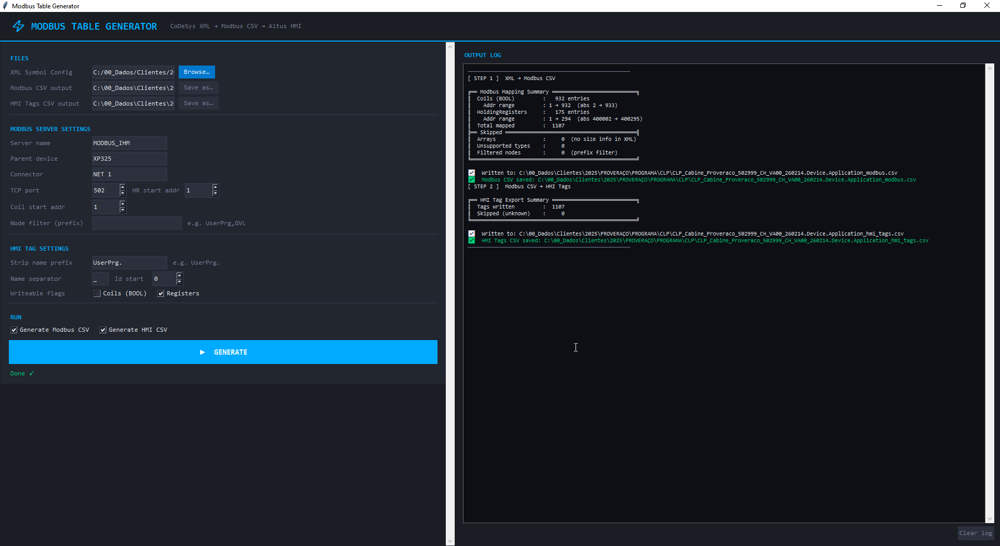

# Modbus Table Generator

> CoDeSys XML → Modbus Server CSV → Altus FvDesigner HMI Tags

Automates Modbus register table creation from CoDeSys PLC projects and converts them to Altus FvDesigner HMI tag files. Handles struct explosion, nested custom types, and multi-register data types automatically.

---



---


## Project Files

Keep all three files in the same folder:

```
📁 your-project/
   modbus_generator.py   # Parses CoDeSys XML → Modbus Server CSV
   modbus_to_hmi.py      # Converts Modbus CSV → Altus FvDesigner HMI tags CSV
   modbus_ui.py          # Desktop UI — imports and calls both scripts above
```

---

## Supported Types

| IEC Type | HMI Type | Modbus Type | Registers |
|---|---|---|---|
| `BOOL` | `Bit` | Coil (`0x`) | 1 |
| `INT` | `16Bit-INT` | HoldingRegister | 1 × 16-bit |
| `UINT` | `16Bit-UINT` | HoldingRegister | 1 × 16-bit |
| `WORD` | `16Bit-INT` | HoldingRegister | 1 × 16-bit |
| `DINT` | `32Bit-INT` | HoldingRegister | 2 × 16-bit |
| `REAL` | `32Bit-FLOAT` | HoldingRegister | 2 × 16-bit |

Any other type is skipped with a warning in the log.

**Addressing:** HMI uses 1-based addressing. `DataStartAddress 0` → `@modbus:4x1` or `@modbus:0x1`. DINT and REAL use the `D` prefix: `@modbus:4xD1`.

---

## Desktop UI

```bash
python modbus_ui.py
```

Left panel for config, right panel for live log. Steps:

1. **FILES** — Browse for the CoDeSys XML. Output paths are auto-filled.
2. **MODBUS SERVER SETTINGS** — Server name, parent, connector, port, start addresses.
3. **HMI TAG SETTINGS** — Name prefix stripping, separator, ID start, writeable flags.
4. **RUN** — Toggle Step 1 / Step 2 independently, then click **GENERATE**.

> The two steps can run independently. To convert an existing Modbus CSV to HMI format only, uncheck *Generate Modbus CSV* and point the Modbus CSV path to the existing file.

---

## CLI — `modbus_generator.py`

Parses a CoDeSys Symbol Configuration XML and outputs a Modbus Server mapping CSV.

```bash
python modbus_generator.py --xml project.xml --server MODBUS_IHM --parent XP325 --out modbus_output.csv
```

| Argument | Default | Description |
|---|---|---|
| `--xml` | *(required)* | Path to CoDeSys XML symbol config |
| `--out` | `modbus_output.csv` | Output Modbus CSV path |
| `--server` | `MODBUS_IHM` | Modbus server name |
| `--parent` | `XP325` | Parent device name |
| `--connector` | `NET 1` | Connector name |
| `--port` | `502` | TCP port |
| `--hr-start` | `0` | HoldingRegister start address (0 = abs 400001) |
| `--coil-start` | `0` | Coil start address (0 = abs 1) |
| `--filter` | *(all)* | Root node prefix filter, e.g. `UserPrg,GVL` |

**Struct resolution:** reads `TypeList` from the XML and recursively explodes user-defined types into their primitive members. Automatically normalizes the `T_` prefix CoDeSys adds to type references (e.g. `T_FB_DATAHORA` → `FB_DATAHORA`). Circular references are guarded.

---

## CLI — `modbus_to_hmi.py`

Converts a Modbus Server CSV to the Altus FvDesigner tag import format. Output is always **CRLF** encoded as required by FvDesigner.

```bash
python modbus_to_hmi.py --in modbus_output.csv --out hmi_tags.csv --name-strip UserPrg. --writeable-coils 0 --writeable-regs 1
```

| Argument | Default | Description |
|---|---|---|
| `--in` | *(required)* | Input Modbus CSV |
| `--out` | `hmi_tags.csv` | Output HMI tags CSV |
| `--id-start` | `0` | Starting Id value |
| `--writeable` | `1` | Default writeable flag (0 = read-only, 1 = writeable) |
| `--writeable-coils` | same as `--writeable` | Override for BOOL/Coil tags |
| `--writeable-regs` | same as `--writeable` | Override for HoldingRegister tags |
| `--name-strip` | *(none)* | Path prefix to strip, e.g. `UserPrg.` |
| `--name-sep` | `_` | Separator replacing `.` in tag names |

**Name stripping example:** `UserPrg.DataHoraModbus.oSegundos` with `--name-strip UserPrg.` → `DataHoraModbus_oSegundos`

---

## Full Pipeline (CLI)

```bash
# Step 1 — XML to Modbus CSV
python modbus_generator.py --xml project.xml --out modbus_output.csv

# Step 2 — Modbus CSV to HMI tags
python modbus_to_hmi.py --in modbus_output.csv --out hmi_tags.csv --name-strip UserPrg. --writeable-coils 0
```

---

## Building a Standalone .exe

Bundle everything into a single executable using PyInstaller. No Python needed on the target machine.

```bash
pip install pyinstaller
```

> If `pyinstaller` is not recognized (common when Python is installed as administrator), use the full path:

```bash
c:\python312\Scripts\pyinstaller.exe --onefile --windowed --add-data "modbus_generator.py;." --add-data "modbus_to_hmi.py;." modbus_ui.py
```

The `.exe` will be at `dist\modbus_ui.exe`.

```
📁 your-project/
   dist/
      modbus_ui.exe   ← distribute this
   build/             ← safe to delete
   modbus_ui.spec     ← safe to delete
```